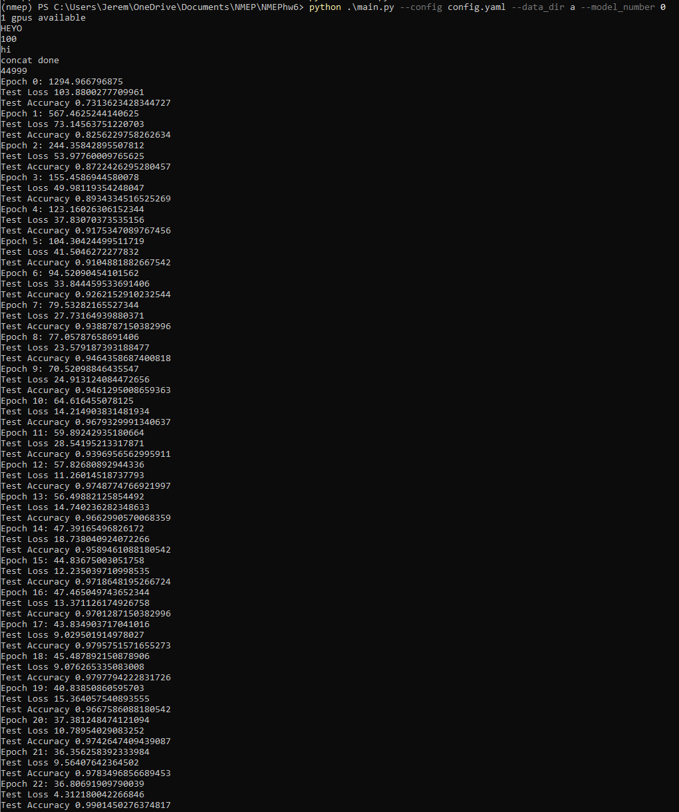

## Self Supervised Learning for Image Classification

In this Project we implement a paper (https://arxiv.org/pdf/1803.07728.pdf) that uses geometric transformations to extract features of an image without requiring these images to be labeled.

### Project Learning Objectives
In this project we will learn :
1. Using pytorch Dataset/DataLoader, load and preprocess data
2. Training a model from scratch and frequently checkpointing models
3. Implement good software engineering skills including the use of virtual environments, git (for partner work), and OOP

## Rotnet results
See results.txt

### Setting up your environment
`pip3 install vitrualenv` (if not already installed)
`virtualenv venv`
`source venv/bin/activate`
`pip3 install -r requirements.txt`

To deactivate the environment you are in run:
`source deactivate`

### Code Structure
`main.py` will contain the training loop and validation for the model. You can start here to get a general idea of the flow of the code base.
`resnet.py` will contain your implementation of the resnet model (you can find the architecture online or in the paper).
`data.py` will contain all your data loading functions.

Once you have implemented the model, you can start training by running `main.py` with the following command:
`python3 main.py --config config.yaml --train --data_dir ./data/cifar-10-batches-py/ --model_number 1`

`config.yaml` contains the configuration file with all the hyperparameters. If you have time, feel free to change these values and see how your model performs.

### Additional Details
#### Downloading the CIFAR-10 dataset
You can read more about the CIFAR-10 dataset here: https://www.kaggle.com/c/cifar-10
1. Go to this link https://www.cs.toronto.edu/~kriz/cifar.html
2. Right click on "CIFAR-10 python version" and click "Copy Link Address"
3. Go to your CLI and go into the `data` directory.
4. Run this cURL command to start downloading the dataset: `curl -O <URL of the link that you copied>`
5. To extract the data from the .tar file run: `tar -xzvf <name of file>` (type `man tar` in your CLI to see the different options for running the tar command).
**NOTE**: Each file in the directory contains a batch of images in CIFAR-10 that have been serialized using python's pickle module. You will have to first unpickle the data before loading it into your model.

#### Working with the dataset
Please consider the format that the data is in and what format you will need to convert it into in order to train your model. If you are stuck on this, feel free to use Google.
Your implementation for getting and loading the data from the model will likely differ from the implementation that I used so feel free to deviate from the skeleton code here.

#### Using pytorch dataloaders
We use tensorflow to build efficient datapipelines. You can read more about them here.
Resource: https://pytorch.org/docs/stable/data.html
And an excellennt turotial on how to use these: https://stanford.edu/~shervine/blog/pytorch-how-to-generate-data-parallel

#### Resnet18 Architecture
https://www.google.com/search?q=resnet+architecture&tbm=isch&source=iu&ictx=1&fir=nrwHYuY3M7ZNXM%253A%252CmlG8I6OjyTBN4M%252C_&vet=1&usg=AI4_-kRZVFcZ9REeELvn4BDXDpOJhFpNQg&sa=X&ved=2ahUKEwjd5NiphYjkAhVPKa0KHROtD3QQ9QEwBHoECAYQCQ#imgrc=eLRQQc-BgrBkxM:&vet=1

#### Saving and Restoring Models
Here is an excellent guide on how to save and restore models in pytorch
https://pytorch.org/tutorials/beginner/saving_loading_models.html
